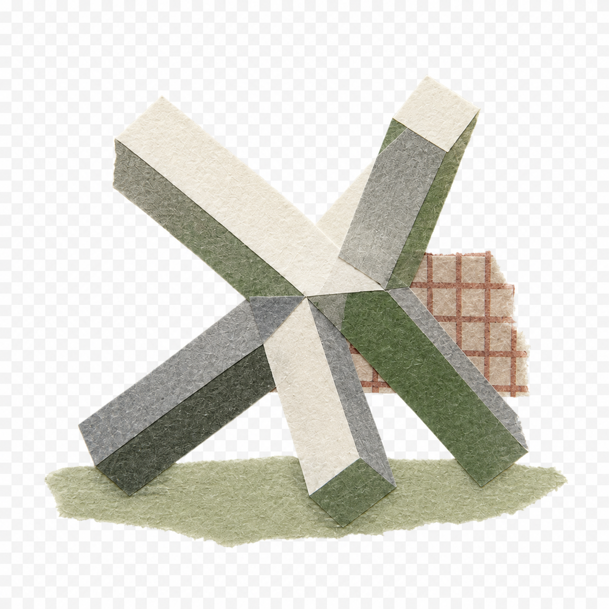
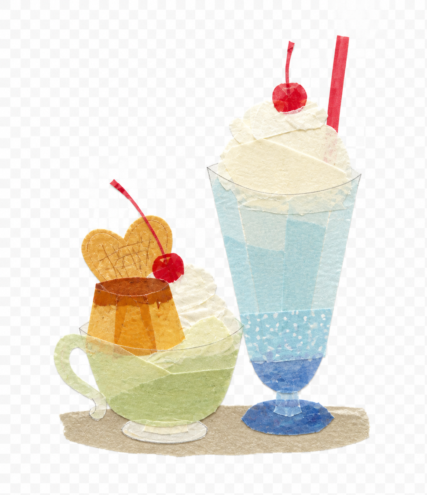
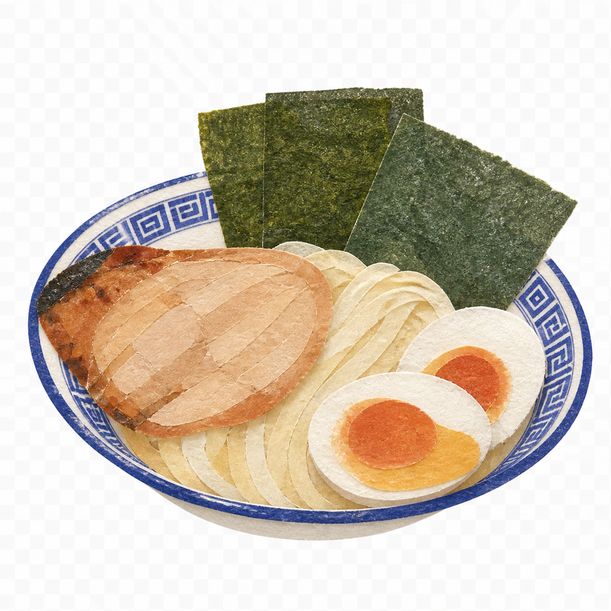
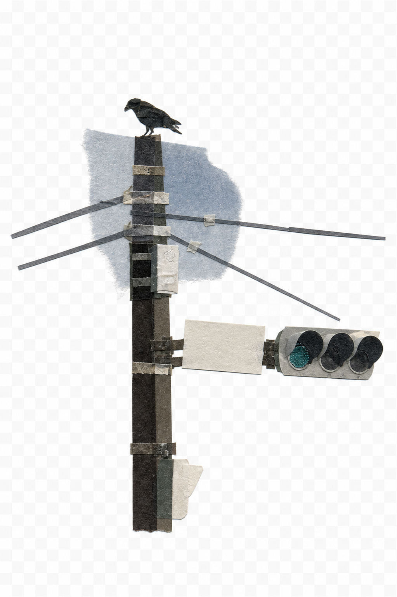
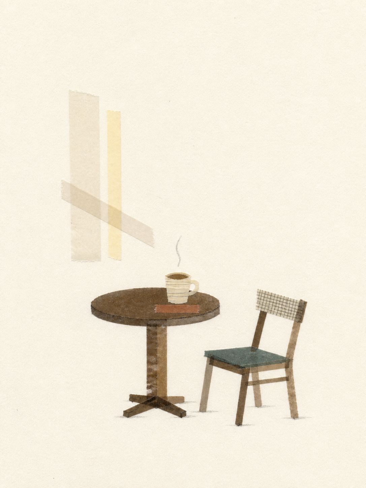

# 胶带拼贴工作室 Tape Collage Studio

一个面向中文用户优化的和纸胶带拼贴 Skill。

它可以把照片、产品、人物、宠物、建筑或文字创意，转换成具有真实纸张纤维、半透明叠压、自然撕边和手工拼贴质感的胶带画；也能在不重绘原照片的情况下，将原图与胶带重构作品组合到同一张画面中。

适用于 Codex、ChatGPT 等支持 Skills 工作流的智能体。

---

## 主要能力

### 1. 照片转胶带拼贴

从照片中提取主体轮廓、姿态、关键色彩和识别特征，再使用宽、中宽和纸胶带重新构建主体。

原照片不会直接出现在成品中，最终效果更接近一幅真正由胶带手工贴出来的平面插画。

适合：

* 人物与宠物照片
* 产品和包装
* 食物、植物和日常物品
* 建筑与旅行照片
* 情绪化场景

### 2. 保留原图并置

当用户明确要求“保留原图”“照片不要改”时，Skill 会将生成与排版分开处理：

* 原照片保持真实，不进行生成式重绘
* 不修改人物面部、产品外观和原始色彩
* 不对原图进行拉伸或强制变形
* 另一侧放置由胶带重新构建的主体
* 使用统一暖白纸张完成最终排版

竖版照片默认采用“左侧原图、右侧胶带拼贴”；横版或方形照片默认采用“上方原图、下方胶带拼贴”。

### 3. 文字描述生成

不需要提供照片，只需描述一个主题、主体或情绪，即可生成胶带拼贴作品。

例如：

* 雨天独处的蓝灰色胶带拼贴
* 一只坐在花盆旁边的猫
* 关于春天和新开始的胶带海报
* 一杯咖啡与清晨阳光
* 具有复古编辑感的城市建筑拼贴

纯文字创作默认不添加任何文字，避免出现无意义英文和乱码。

### 4. 透明 PNG 胶带素材

可以只生成独立的胶带主体，用于 Photoshop、Figma、电商设计或后续排版。

透明素材模式会检查：

* 是否具有真实 Alpha 透明通道
* 是否出现白底或纸色矩形
* 是否存在棋盘格假透明
* 主体边缘是否被裁切
* 阴影是否只保留在胶带内部

### 5. 中文精确排版

普通图像模型容易出现中文错字，因此本 Skill 默认先生成无字画面，再通过确定性脚本添加文字。

支持：

* 中文标题
* 英文标题
* 数字和日期
* 品牌名称
* 多行排版
* 自定义字号、颜色和位置
* 中文字体自动适配

用户没有要求文字时，不会自动添加英文标题、日期、副标题或装饰性伪文字。

### 6. 定向返修

修改已有作品时，只调整用户明确指出的问题。

例如：

* 只放大胶带主体
* 只调整标题位置
* 只加强胶带纤维
* 只减少画面元素
* 只修改背景颜色
* 保持原图不变，仅调整右侧拼贴
* 保持构图不变，仅修正中文文字

不会因为修改一个局部问题而擅自改变主体、姿态、品牌色、画幅或其他已确认内容。

---

## 三种视觉强度

### 极简留白

适合头像、装饰图、情绪卡片和简洁封面。

* 使用约 8–14 块胶带
* 主体较小
* 保留大量纸面留白
* 依靠轮廓和关键色识别主体

### 平衡叙事

默认使用的表现方式，适合照片转换、小红书封面和一般社媒作品。

* 使用约 12–22 块胶带
* 主体结构更加完整
* 可加入少量来自原图的环境呼应
* 在识别度、材质感和留白之间保持平衡

### 商业主视觉

适合产品、电商主图、宣传封面和活动海报。

* 使用约 16–30 块胶带
* 主体更大，视觉冲击力更强
* 优先保护产品轮廓和品牌色
* 主动预留标题区、卖点区或产品信息区
* 不自动编写或生成营销文案

---

## 平台画幅适配

| 使用场景      | 默认比例     |
| --------- | -------- |
| 普通胶带拼贴作品  | 3:4      |
| 小红书图片与封面  | 3:4      |
| 抖音、快手竖版海报 | 9:16     |
| 方形头像与封面   | 1:1      |
| 用户指定尺寸    | 严格按照指定比例 |

Skill 会根据画幅重新组织构图，不会简单地把同一版式强行拉伸。

---

## 风格特点

作品以真实和纸胶带为主要视觉媒介，强调：

* 哑光纸质纤维
* 自然半透明效果
* 胶带叠压处的颜色加深
* 柔和毛边与自然撕边
* 少量折痕、气泡和微翘边
* 克制的浅层接触阴影
* 明确而完整的主体轮廓
* 安静、干净的暖白纸张
* 具有编辑设计感的留白

作品应当像真实胶带贴在纸面上，而不是普通矢量插画加一层纸张滤镜。

---

## 风格参考

以下图片只用于约束胶带材质、结构提炼和留白方式，不会复制其中的具体主体。

| 结构提炼                                | 胶带叠压                                | 食物综合色感                              |
| ----------------------------------- | ----------------------------------- | ----------------------------------- |
|  |  |  |

| 竖向线性结构                              | 安静场景与留白                             |
| ----------------------------------- | ----------------------------------- |
|  |  |

---

## 明确避免

除非用户主动要求，否则不会添加：

* 票据、邮票和旧报纸
* 地图、印章和无关标签
* 剪刀、胶带卷和画笔
* 手部或杂乱桌面道具
* 无意义英文和乱码
* 铅笔线、墨线和粗描边
* 塑料贴纸质感
* 数字渐变和光滑矢量面
* 密集碎纸和马赛克结构
* 厚重投影和立体纸雕
* 水印、签名和无关标志
* 过度泛黄、污渍和重度做旧

---

## 安装方法

### Codex

将仓库克隆到个人 Skills 目录：

```bash
git clone https://github.com/152xiaoxin/tape-collage-studio.git \
  "${CODEX_HOME:-$HOME/.codex}/skills/tape-collage-studio"
```

也可以下载 ZIP，将解压后的完整文件夹放入：

```text
~/.codex/skills/tape-collage-studio/
```

确保 `SKILL.md` 位于该文件夹根目录。

### 项目级安装

如果只希望在某个项目中使用，可以放入项目的 Skills 目录：

```text
项目目录/.codex/skills/tape-collage-studio/
```

---

## 使用示例

### 照片转胶带拼贴

```text
使用 $tape-collage-studio，把这张猫咪照片做成和纸胶带拼贴，不要文字。
```

### 小红书封面

```text
使用 $tape-collage-studio，把这张照片做成3:4小红书胶带拼贴封面，主体放在右下角，左上方保留标题空间。
```

### 抖音竖版海报

```text
使用 $tape-collage-studio，把这个产品做成9:16胶带拼贴商业主视觉，保留包装轮廓和品牌色，不要生成文字。
```

### 保留原照片

```text
使用 $tape-collage-studio，保留这张照片，不要修改人物，把胶带重构放在右侧纸面。
```

### 文字创作

```text
使用 $tape-collage-studio，生成一张关于雨天独处的蓝灰色胶带拼贴作品，大量留白，不要文字。
```

### 透明 PNG

```text
使用 $tape-collage-studio，把这只猫做成独立胶带拼贴素材，输出透明背景PNG。
```

### 精确中文标题

```text
使用 $tape-collage-studio，保持画面不变，在左上方准确添加“春日来信”，不要增加其他文字。
```

---

## 文件结构

```text
tape-collage-studio/
├── SKILL.md
├── LICENSE
├── agents/
│   └── openai.yaml
├── assets/
│   ├── icon.svg
│   ├── fonts/
│   │   ├── ZCOOLXiaoWei-Regular.ttf
│   │   └── OFL.txt
│   └── style-references/
│       ├── 01.png
│       ├── 02.png
│       ├── 03.png
│       ├── 04.png
│       └── 05.png
├── references/
│   ├── prompt-recipes.md
│   └── style-system.md
└── scripts/
    ├── add_exact_text.py
    └── compose_direct_split.py
```

---

## 核心文件

### `SKILL.md`

负责识别用户意图、选择工作模式、确定画幅、生成图像、处理文字和执行质量检查。

### `references/style-system.md`

定义胶带材质、构图、配色、纸张、文字和禁止元素。

### `references/prompt-recipes.md`

包含照片转换、纯文字生成、产品海报、透明素材和定向返修的中文提示词配方。

### `scripts/add_exact_text.py`

在不重新生成图片的情况下，为作品添加准确的中文或英文文字。

### `scripts/compose_direct_split.py`

负责原图与胶带重构的确定性合成，控制照片裁切、纸张纹理、胶带位置、阴影和标题排版。

---

## 环境要求

本地使用辅助脚本时需要：

* Python 3
* Pillow

安装 Pillow：

```bash
pip install Pillow
```

图片生成功能由当前智能体所连接的图像生成工具完成。

---

## 已知边界

* 胶带重构会保留人物姿态和主要识别特征，但不保证精确还原人物面部身份。
* 复杂场景会主动简化，不会把所有建筑、人物和背景细节全部复刻。
* 产品标签文字需要完全准确时，建议使用原图并置或后期排版。
* 不同图像生成模型对透明背景、中文和胶带材质的理解能力可能不同。
* 参考图只提供风格约束，不代表每次生成都会产生完全一致的画面。

---

## 设计原则

这个 Skill 的目标不是把画面堆满胶带，而是用尽可能少且有效的胶带结构，保留主体识别度、手工质感和设计秩序。

一张合格的胶带拼贴，应当同时满足：

1. 主体一眼可辨认
2. 第一眼像真实胶带
3. 留白足够，画面不拥挤
4. 没有无意义装饰
5. 指定文字完全准确
6. 修改时不破坏已确认内容
